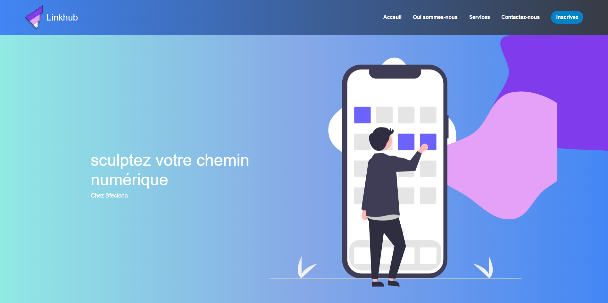

# E-Learning Platform - Linkhub



## 🚀 About
Linkhub is a modern e-learning platform that helps you "sculptez votre chemin numérique" (sculpt your digital path). Built with React and Vite for a fast, responsive learning experience.

## ✨ Features
- Modern and intuitive user interface
- Responsive design for all devices
- Real-time learning experience
- Interactive course management
- User authentication and profiles

## 🛠️ Tech Stack
- **Frontend**: React 18, Vite
- **Styling**: Bootstrap, Material-UI, Styled Components
- **Charts**: ApexCharts, Recharts, Nivo
- **Icons**: FontAwesome, React Icons
- **Other**: Socket.io, Axios, React Router

## 🏃‍♂️ Getting Started

### Prerequisites
- Node.js (v16 or higher)
- npm or yarn

### Installation

1. Clone the repository
```bash
git clone https://github.com/rezgui-yassine/Elearning.git
cd e-learning-main
```

2. Install client dependencies
```bash
cd client
npm install
```

3. Install server dependencies
```bash
cd ../server
npm install
```

4. Install socket dependencies
```bash
cd ../socket
npm install
```

### Running the Application

1. Start the client (from client directory)
```bash
npm start
```

2. Start the server (from server directory)
```bash
npm start
```

3. Start the socket server (from socket directory)
```bash
npm start
```

The application will be available at `http://localhost:5173/`

## 📁 Project Structure
```
e-learning-main/
├── client/          # React frontend
├── server/          # Backend API
├── socket/          # Socket.io server
└── uploads/         # File uploads
```

## 🤝 Contributing
Contributions are welcome! Please feel free to submit a Pull Request.

## 📄 License
This project is licensed under the MIT License.